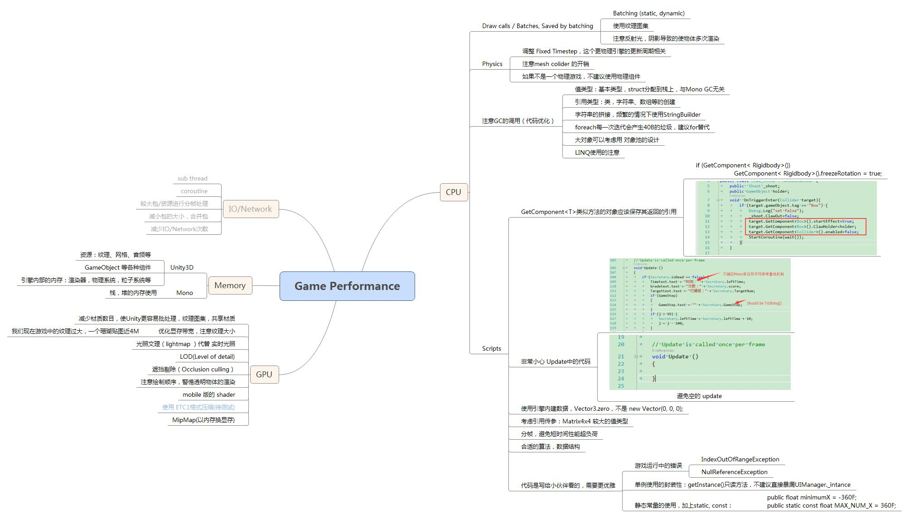

#Unity CSharp Coding Guides#

----------
**document version:**	1.0  
**author:** stan  
**date:** 2016/1/19

# Part 1. Coding Style #

## 概述 ##

- 方便项目的交流和维护。
- 不影响编码效率，不与大众习惯冲突。
- 代码颜值更高、方便阅读。
- 代码逻辑更清晰、更易理解。
- 优秀的Code是写给人看的，而不是写给机器看的。

## 代码外观 ##

### 换行 ###
当表达式超出或即将超出规定的列宽，遵循以下规则进行换行

- 在逗号后换行
- 在操作符前换行。
- 规则1优先于规则2。

当以上规则会导致代码混乱的时，自己采取更灵活的换行规则。

### 缩进 ###
缩进是每行一个Tab键位(4个空格)，建议使用Tab键代替空格键缩进。

### 空行 ###
空行是为了将逻辑上相关联的代码分块，以便提高代码的可阅读性。  
在以下情况下使用**两个空行**（注：不建议一个文件中写多个类或接口）

- 接口和类的定义之间。
- 枚举和类的定义之间。
- 类与类的定义之间。

在以下情况下使用**一个空行**

- 方法与方法之间。
- 方法中变量声明与语句之间。
- 方法中不同的逻辑块之间。
- 方法中的返回语句与其他的语句之间。
- 属性与方法、属性与字段、方法与字段之间。
- 注释与它注释的语句间不空行，但与其他的语句间空一行。

### 空格 ###
在以下情况中要使用到空格

- 关键字和左括符“(”应该用空格隔开。如  

    	while (true)

注意在方法名和左括符“(”之间不要使用空格，这样有助于辨认代码中的方法调用与关键字。

- 多个参数用逗号隔开，每个逗号后加一个空格。
- 除了 **.** 之外，所有的二元操作符都应用空格与它们的操作数隔开。一元操作符、++及--与操作数间不需要空格。如

		a += c + d;
		a = (a + b) / (c * d);
		while (d++ = s++)
		{
			n++;
		}
		PrintSize("sizeis" + size.ToString() + "\n");

- 语句中的表达式之间用空格隔开。如

		for(expr1; expr2; expr3)

## 注释 ##

- 文档型注释  
类注释采用.Net已定义好的Xml标签来标记(在IDE中连按三次“/”键可自动完成下述注释结构)，在声明接口、类、方法、属性、字段都应该使用该类注释，以便代码完成后直接生成代码文档，让别人更好的了解代码的实现和接口。如

    	/// 

		/// Method Description
		/// 

		/// <param name="number"></param>
		/// <returns></returns>
		public static int MyMethod(int number)
		{
			return 0;
		}

- 单行注释  
方法内的代码注释。如变量的声明、代码或代码段的解释。注释示例：

		//注释语句
		private int number;
方法内变量的声明或花括号后的注释,注释示例：

		if(1==1)//always true
		{
			statement;
		}//always true
括号内代码过多时，建议右花括号“}”后一个注释以便于方便的找到与之相应的{

		if (valid)
		{

		}//if valid
		else
		{

		}//not valid

## 命名规范 ##
- 命名概述  
名称应尽可能的体现是“什么”。保留对象层面的抽象含义。例如，使用**GetNextEnemy()**，而优于 **GetNextArrayElement()**。  
使大家能快速明白名字的含义，尽可能不产生歧义，去猜测变量的意义。
- 命名原则：  

 

2. 不建议使用拼音，或拼音的缩写命名，不便阅读。
3. 在类属性的名称中包含类名是多余的，如**Book.BookTitle**。而是应该使用**Book.Title**。
4. 只要合适，在变量名的末尾或开头加计算限定符（**Avg、Sum、Min、Max、Index**）。
5. 在变量名中使用互补对，如 **min/max**、**begin/end** 和 **open/close**。
6. 布尔变量名应该包含 **is**，这意味着 **Yes/No** 或 **True/False** 值，如 **isFileFound**。
8. 即使对于可能仅出现在几个代码行中的生存期很短的变量，仍然使用有意义的名称。仅对于短循环索引使用单字母变量名，如i或j。
9. 尽量不要使用原义数字或原义字符串,在代码中出现**魔法数字**，不建议 **for (int i = 0; i < 7; i++)**。建议 **for (int i = 0; i < NUM_DAYS_IN_WEEK; i++)** 以便于维护和理解。

 

- 首字母大写的 Pascal 命名情况：  
**namespace, class, enum, event, interface, public method, property, public field**

- 全部大写：众所周知的简称，如 IO, UI, TV, AD, HUD等  

		Immersion.IO
		Immersion.UI

- 全部大写，单词间由**下划线**链接，const 常量，配置信息等

		static const int BUFFER_LENGTH = 10;

- 类中的私有字段，采用 **下划线加Camel** 命名方法

		private int _currentFrame;
		private static AnimationController _instance;

- 私有方法，局部变量，方法参数 采用Camel命名方法

		private int updateEnemy();
		bool isValid

- Interface 命名应以**Ｉ**开头为 **IXxx** 如：  

		public interface IDrawable
		public interface IComponent

- 属性 Attribute 应以 Attribute 结尾

		public class ObsoleteAttribute
		{
		}

- 常用对象，需加对象的简称作为前缀，如一个头像的Image对象实例： imgHead 或 _imgHead：  
常用命名简称：

		- Name 				- prefix
		Border				bdr	   
		Button				btn	   
		CheckBox			chk	   
		ComboBox			cbx	      
		Image				img	   
		Label				lbl
		Layer				lyr
		Position			pos	   
		ProcessBar			pb	   
		RadioButton			rb	 
		Sprite				spr
		Texture				tx

# Part 2. Tips#

##For Performance##
- Update 每秒钟会执行多次，这个方法的执行效率非常重要，非常小心 Update 中的代码
- 在 Awake 中获取游戏对象引用，避免多次查找对象引用

		void Awake ()
		{
			_myBox = GetComponent<Box>();
		}

- 注意字符拼接过程导致的性能问题，如果字符串过多，应使用StringBuilder
- 注意值类型的**装箱**，**拆箱**引起的性能损失

		//如下面代码将造成两次装箱
		string text = "Scores: " + score + ", Coins:" + coin;

		//应使用如下方式，避免两次装箱。
		private static string SCORE_FORMAT = "Scores: {0}, Coins {1}";
		StringBuilder textSb = String.Format(SCORE_FORMAT, score.ToString(), coin.ToString());

- 空的 Update 方法应该注释，或删除掉，避免调用堆栈的性能开销
- 使用引擎内的数据结构

		//不好
		new Vector3(0, 0, 0);
		//好的
		Vector3.zero

- Matrix4x4 等较大的值类型，因考虑使用引用传参，默认的值传参会引起栈上的内存拷贝
- 游戏中的错误一定要处理，警告也应该关注

		IndexOutOfRangeException, NullReferenceException

- 频繁申请释放的大对象，可以考虑对象池的技术进行管理。避免过于频繁的内存申请/释放
- foreach 由于Unity 采用的 mono版本 编译器的Bug， 会造成 finally 代码块中 boxing 的操作，所以会产生 24B 的垃圾，应使用for或者while来代替foreach

## For OO ##
- 注意 class 的封装性，不能所有成员都是 public, 如果还没有决定好是否要 public出去，建议先使用 private， 当其他对象需要使用时，在public出去

- 避免游戏中的**魔法数字**等 

		//不好
		if(Secretary.GameStep == 1)
		
		//好，定义一个 const 常量进行管理
		if(Secretary.GameStep == INIT_FISH)

- 全局的配置信息，应统一到一个类中进行管理

		public class GlobalConfig
		{
			public const string GAME_VERSION = "1.0.3.2";
			public const int GAME_VERSION_NUM = 1322;
			public const int DESIGN_RESOLUTION_WIDTH = 960;
			public const int DESIGN_RESOLUTION_HEIGHT = 640;
		}

- 单例模式的封装，应该使用 getInstance() 返回单例的实例，不应该直接暴漏 _instance.

		private static UIManager _instance;
		public static UIManager getInstance() 
		{
			if (null == _instance)
			{
				_instance = new UIManager();
			}
		
			return _instance;
		}

## Summary

